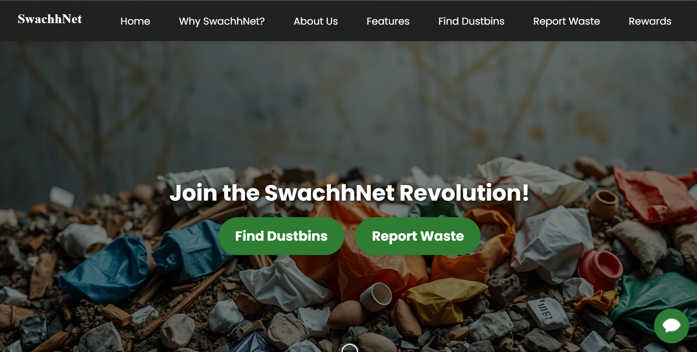
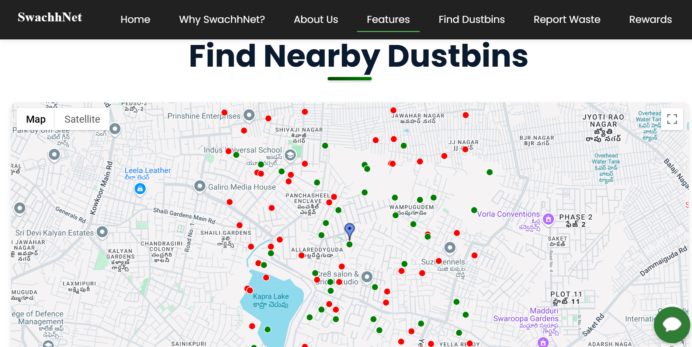

SwachhNet
=========

Hey there! Welcome to SwachhNet, a web app I’ve built to make waste management smarter and more rewarding. Whether you’re hunting for a nearby dustbin, reporting a pile of trash with a quick photo, or earning points for keeping things clean, SwachhNet has you covered. It’s all about connecting citizens and municipalities to create cleaner, healthier cities—one dustbin at a time.

In this README, I’ll explain what SwachhNet is, why I made it, and how you can get it running on your own machine with simple steps. The backend runs on Cloudflare Workers (in the swachhnet-wrangler/ folder), and the frontend is hosted as static files on Firebase (in the swachhnet-firebase/ folder). Let’s get started!

What is SwachhNet?

SwachhNet is a web application designed to tackle waste management challenges. Need to find the nearest dustbin? Want to report litter that’s been ignored? SwachhNet makes it easy with an interactive map, a simple reporting tool, and a rewards system to keep you motivated. It bridges the gap between everyday people and municipalities, working together for cleaner cities.

Why I Built This
----------------

I created SwachhNet because I was tired of seeing overflowing dustbins and scattered litter. Unmanaged waste isn’t just ugly—it’s a health hazard, pollutes our environment, and hurts a city’s vibe. Finding a dustbin or getting trash picked up shouldn’t be a struggle, so I built this app to use tech to fix that. SwachhNet turns frustration into action, making waste management accessible and rewarding for everyone.

Goals of the Project
--------------------

Here’s what SwachhNet aims to achieve:

*   **Connect People to Dustbins**: Show nearby dustbins with real-time status (full or available).
    
*   **Simplify Waste Reporting**: Let users report waste quickly so municipalities can respond.
    
*   **Encourage Good Habits**: Reward responsible waste disposal and community cleanup efforts.
    
*   **Cleaner Cities**: Reduce litter, boost public health, and make our streets shine.
    

Features
--------

SwachhNet packs some handy tools:

*   **Find Nearby Dustbins**: A map with green dots for available dustbins and red for full ones.
    
*   **Report Waste**: Snap a photo, add details, and send it to the authorities.
    
*   **Earn Rewards**: Collect points for using dustbins or reporting waste, redeemable for eco-friendly items.
    
*   **Track Your Impact**: See how your actions contribute to a cleaner community.
    

Getting Started
---------------

Ready to run SwachhNet yourself? The project has two parts: a backend (Cloudflare Worker) and a frontend (Firebase Hosting). Follow these steps to set it up after cloning the repo.

Below is a structured and updated version of the "Getting Started" section for your `README.md`, tailored to your specific project structure. Your repository contains two folders: `swachhnet-firebase/temp` for static frontend files and `swachhnet-wrangler` for the backend `index.js` file (Cloudflare Worker for the chatbot API). I’ve adjusted the instructions to reflect this setup, including a brief explanation of cloning the repo, installing Cloudflare Wrangler and Firebase CLI, and deploying both components. Since you mentioned that users need to tune components according to their `.jsonc` files (likely referring to `package.json` or `wrangler.toml`), I’ve added notes to guide them.


---


## Getting Started


Ready to set up SwachhNet? The project is split into two parts: a backend (Cloudflare Worker) in `swachhnet-wrangler/` and a frontend (static files) in `swachhnet-firebase/temp/`. Here’s how to get it running on your machine, step by step.


### Prerequisites


Before you start, make sure you have the following installed:


- **Node.js (v14 or higher) and npm**: Powers both backend and frontend. Download from [nodejs.org](https://nodejs.org).
- **Cloudflare Account**: For the backend. Sign up at [cloudflare.com](https://cloudflare.com).
- **Firebase Account**: For hosting the frontend. Sign up at [firebase.google.com](https://firebase.google.com).
- **API Keys**:
  - **Google Maps**: For the frontend map. Get one from [Google Cloud Console](https://console.cloud.google.com).
  - **Gemini AI**: For the backend chatbot and image analysis. Obtain from your provider (e.g., Google AI services).


#### Install CLIs Globally


You’ll need these command-line tools:


```bash
npm install -g @cloudflare/wrangler
npm install -g firebase-tools
```


#### Log In to Services


Authenticate with Cloudflare and Firebase:


```bash
wrangler login
firebase login
```


### Cloning the Repository


To get the project files:


1. Open your terminal (or command prompt).
2. Run this command to clone the repo:
   ```bash
   git clone https://github.com/Shesha-Sai-999/swachhnet.git
   ```
   Replace `yourusername` with your actual GitHub username.
3. Move into the project folder:
   ```bash
   cd swachhnet
   ```


You’ll see two folders: `swachhnet-wrangler/` (backend) and `swachhnet-firebase/temp/` (frontend static files).


### Backend Setup (Cloudflare Worker)


The backend, located in `swachhnet-wrangler/`, runs on Cloudflare Workers and handles the chatbot API (`index.js`).


1. **Navigate to the backend folder:**
   ```bash
   cd swachhnet-wrangler
   ```


2. **Set up project configuration:**
   - The repo only includes `index.js`. You’ll need a `package.json` and `wrangler.toml` to deploy it.
   - Create a basic `package.json` (if not present):
     ```bash
     npm init -y
     ```
   - Create or edit `wrangler.toml` in this folder with:
     ```toml
     name = "swachhnet-backend"
     compatibility_date = "2023-10-01"
     [vars]
     GEMINI_API_KEY = "your_gemini_api_key_here"
     ```
     Replace `"your_gemini_api_key_here"` with your Gemini API key.


3. **Install dependencies:**
   - Since `index.js` is standalone, no extra npm packages are needed unless you add more features. If you do, run:
     ```bash
     npm install
     ```


4. **Test locally:**
   ```bash
   wrangler dev
   ```
   - Open `http://localhost:8787` in your browser. You should see "✅ Server is running!" for a GET request to `/`.
   - Test endpoints:
     - POST to `/api/chat` with `{ "userMessage": "Hello" }` (use a tool like Postman).
     - POST to `/api/analyze-image` with an image file.


5. **Deploy to Cloudflare:**
   ```bash
   wrangler deploy
   ```
   - After deployment, you’ll get a URL (e.g., `https://swachhnet-backend.yourusername.workers.dev`). Save this for the frontend setup.


**Note:** If you encounter errors, ensure `wrangler.toml` matches your Cloudflare account settings (e.g., account ID if required). Check the [Cloudflare Workers docs](https://developers.cloudflare.com/workers/) for troubleshooting.


### Frontend Setup (Firebase Hosting)


The frontend static files are in `swachhnet-firebase/temp/`. These are hosted on Firebase.


1. **Navigate to the frontend folder:**
   ```bash
   cd ../swachhnet-firebase/temp  # From swachhnet-wrangler/, go back and into temp
   ```


2. **Install dependencies:**
   - If there’s a `package.json`, run:
     ```bash
     npm install
     ```
   - If not, you might need to set up a basic React/Vite project (see note below).


3. **Update the API base URL:**
   - Open `script.js` (or another config file) and update the API URL to your Cloudflare Worker URL:
     ```javascript
     const API_URL = "Your-Cloudwrangler-URL";
     ```
   - Replace with your deployed backend URL.


4. **Update Google Maps API key:**
   - In `index.html`, find the Google Maps script and add your key:
     ```html
     <script src="https://maps.googleapis.com/maps/api/js?key=YOUR_GOOGLE_MAPS_API_KEY"></script>
     ```
   - Replace `Your_Google_Maps_API_Key` with your actual key.


5. **Build the static files:**
   - If you have a build script (e.g., for React), run:
     ```bash
     npm run build
     ```
   - This creates a `build/` folder (or similar). If no build script exists, assume `temp/` contains pre-built files.


6. **Initialize Firebase:**
   ```bash
   firebase init
   ```
   - Select "Hosting" when prompted.
   - Choose your Firebase project (create one if needed).
   - Set the public directory to `build` (if built) or `temp` (if pre-built files are in `temp/`).


7. **Deploy to Firebase:**
   ```bash
   firebase deploy
   ```
   - You’ll get a URL (e.g., `https://your-project.firebaseapp.com` or similar). This is your live frontend.


**Note:** If `temp/` only has raw HTML/CSS/JS files without a `package.json`, users can skip `npm install` and `npm run build`, and directly use `temp/` as the public directory. If it’s a React project, they’ll need to set it up with `npm init react-app` or similar first.


### Running the Project


- **Backend Locally:** From `swachhnet-wrangler/`, run:
  ```bash
  wrangler dev
  ```
- **Frontend Locally:** If there’s a dev server (e.g., `npm start`), run it in `swachhnet-firebase/temp/`. Otherwise, test the deployed Firebase URL.
- **Full App:** Deploy both parts and visit the Firebase URL, which connects to the Cloudflare backend.


---

Having trouble running files? Contact Me: [Linkedin](https://www.linkedin.com/in/shesha-sai-geethri-734311258/)
    

How to Use It
-------------

With SwachhNet running:

*   **Find Dustbins:** Click “Find Dustbins” in the nav bar. The map shows green (available) and red (full) markers. Click one for directions.
    
*   **Report Waste:** Go to “Report Waste,” add a location, waste type, description, and photo (optional), then submit.
    
*   **Earn Rewards:** Visit “Rewards” to see your points and redeem them for eco-friendly items.
    
*   **Track Progress:** Check “Track Progress” for stats on your contributions.
    

MVP in Action
-------------
Watch SwachhNet in action: [Mvp link](https://swachhnet-project.web.app/).
Here’s what SwachhNet looks like in action 


*   **Homepage:**  

    
*   **Dustbin Map:**  
    


Acknowledgments
---------------

Thanks to:

*   **Google Maps API:** For the awesome map integration.
    
*   **Gemini AI:** Powers the chatbot and image analysis.
    
*   **Cloudflare Workers & Firebase:** Hosting the backend and frontend.
        
*   You, for keeping the world cleaner!
